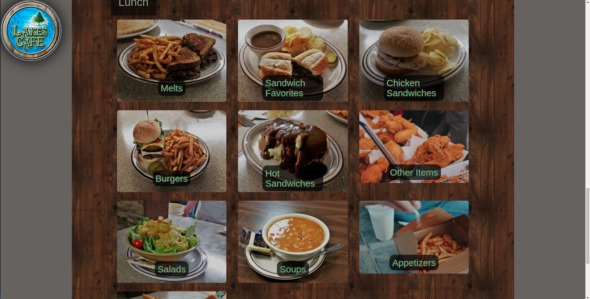
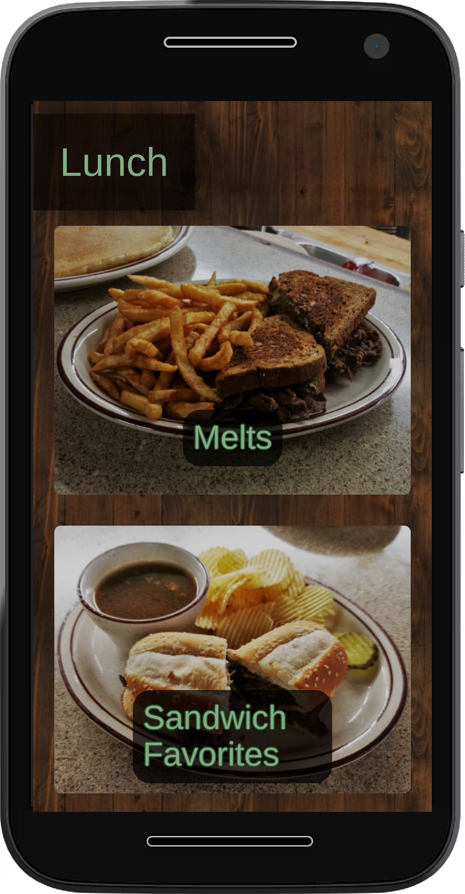
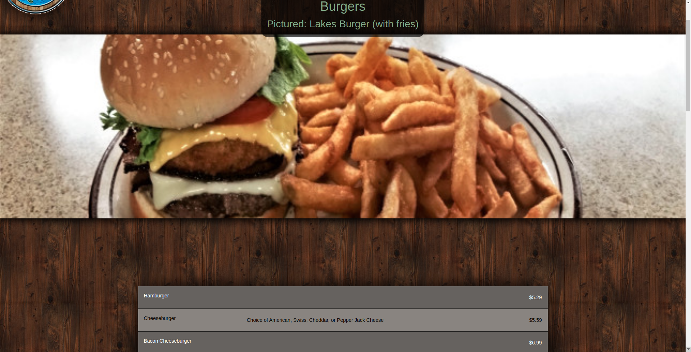
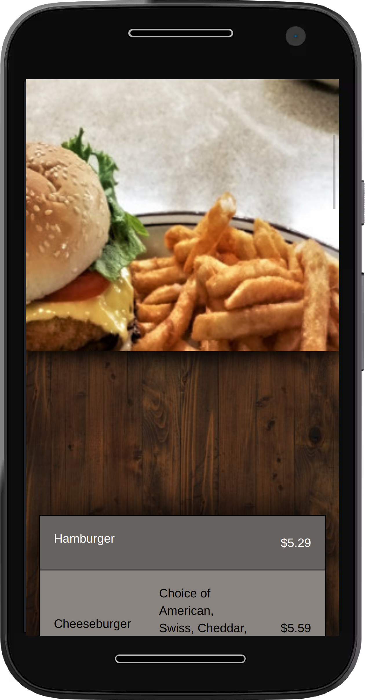
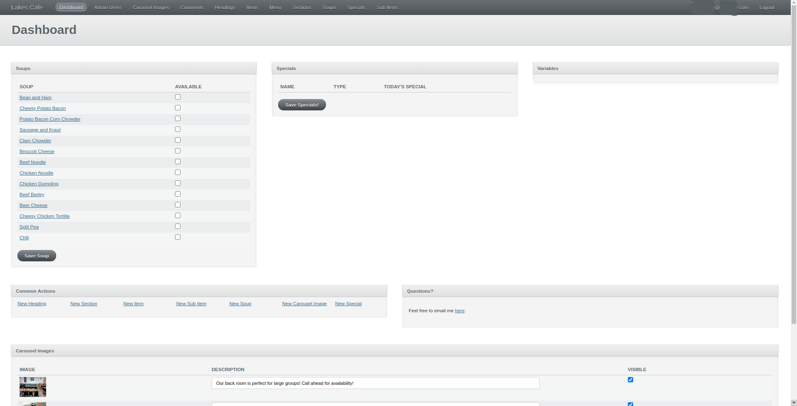

# Lakes Cafe Website

A website developed for a small-town cafe.
See the demo [here](http://lakescafe.herokuapp.com)

## Features

- Upload images via Google Drive for persistent storage
- Customize the menu in the format of Heading -> Section -> Item -> SubItem
- Toggle soups for each day
- Set a special for the day
- Set images for the carousel
- JSON API endpoints for external use

## Screenshots

### Menu Page

## Browse a Category

## Administration Dashboard

Implementation of ActiveAdmin

